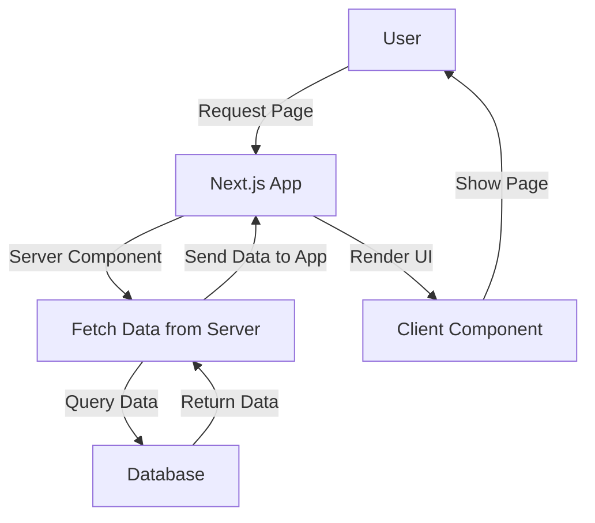
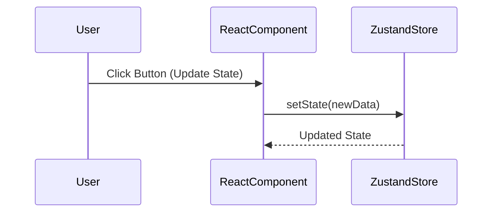
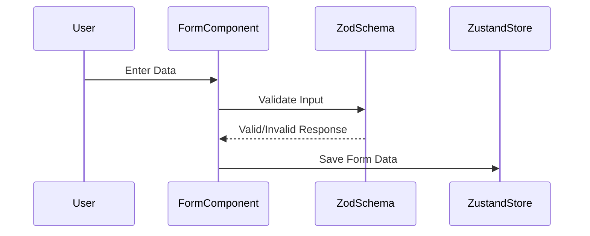
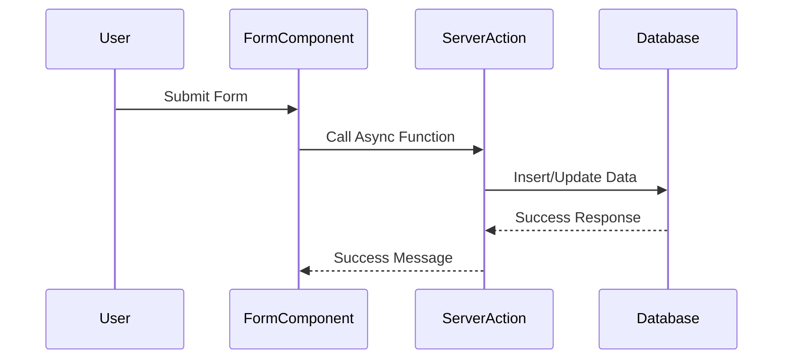
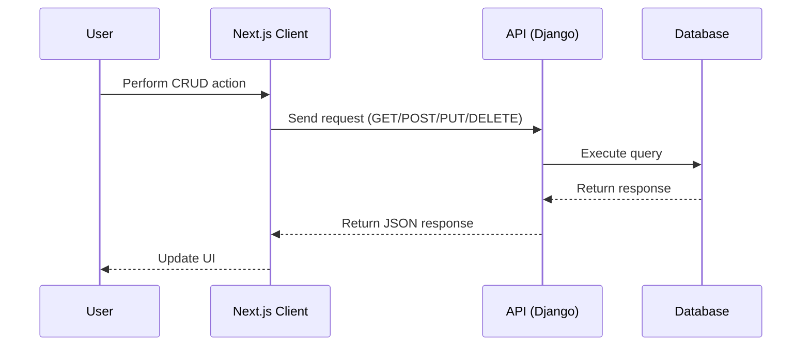
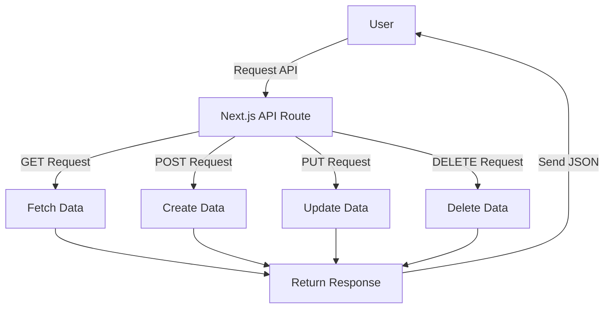
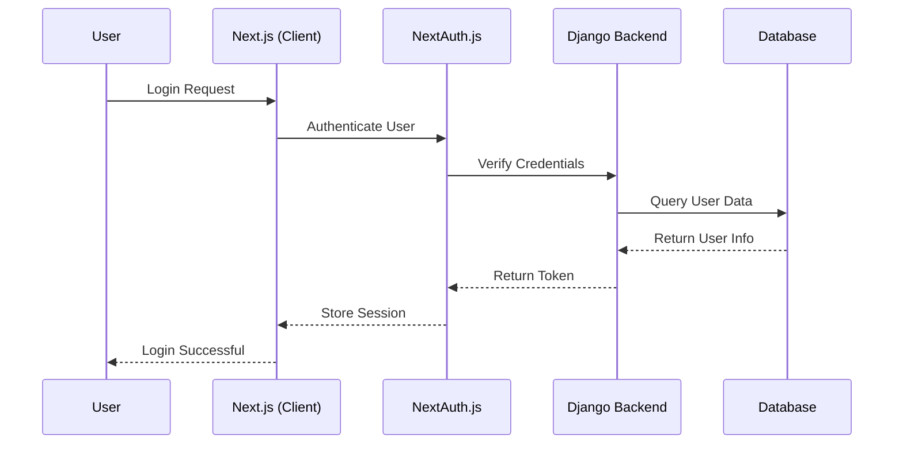

Here are multiple **Mermaid.js** diagrams explaining various **Next.js** concepts, including **Zod, Zustand, React Hook Form, Server Actions, Server & Client Components, Database interactions, and API communication with a Django backend.**

---

## **1️⃣ Next.js Architecture: Client & Server Components**

### **🛠 How Next.js renders pages using Server & Client Components**

### **🛠 Next.js Architecture: Client & Server Components**

🔹 **Explanation**:

- **Server Components** fetch data **directly from the database**.
- **Client Components** hydrate on the browser.

---

## **2️⃣ Next.js + Zustand for State Management**

### **🗄 Zustand store flow in Next.js**

🔹 **Explanation**:

- The **React component updates Zustand** with `setState()`, triggering a re-render.

---

## **3️⃣ Next.js Form Handling with React Hook Form + Zod Validation**

### **📋 Form validation using Zod and React Hook Form**

🔹 **Explanation**:

- **React Hook Form** captures input.
- **Zod validates data** before updating Zustand.

---

## **4️⃣ Server Actions in Next.js**

### **⚡ Handling form submission via Server Actions**

🔹 **Explanation**:

- The form calls a **server action** to store data in the database.

---

## **5️⃣ CRUD Operations in Next.js with a Django Backend**

### **🔄 API interaction between Next.js and Django**

🔹 **Explanation**:

- **Next.js fetches data** from a **Django REST API**.
- The API interacts with the **database** and **returns JSON**.

---

## **6️⃣ Next.js API Routes Handling CRUD Operations**

### **🔧 How Next.js API routes work**

🔹 **Explanation**:

- **Next.js API routes** handle **CRUD operations** internally.

---

## **7️⃣ Authentication Flow in Next.js with Django Backend**

### **🔑 User authentication process**

🔹 **Explanation**:

- **NextAuth.js handles authentication** and **communicates with Django**.

---

## **🔥 Summary**

| **Concept**                    | **Diagram Type**     | **Explanation**                                   |
| ------------------------------ | -------------------- | ------------------------------------------------- |
| **Server & Client Components** | **Flowchart**        | Shows how Next.js **renders pages**               |
| **Zustand State Management**   | **Sequence Diagram** | How **Zustand updates state**                     |
| **React Hook Form + Zod**      | **Sequence Diagram** | Validating form input **before updating Zustand** |
| **Server Actions**             | **Sequence Diagram** | Handling **form submission without API routes**   |
| **CRUD with Django API**       | **Sequence Diagram** | Fetching data from **Django backend**             |
| **Next.js API Routes**         | **Flowchart**        | Handling **CRUD inside Next.js**                  |
| **Authentication**             | **Sequence Diagram** | Login flow with **NextAuth.js and Django**        |

Would you like **any specific diagram expanded further?** 🚀
